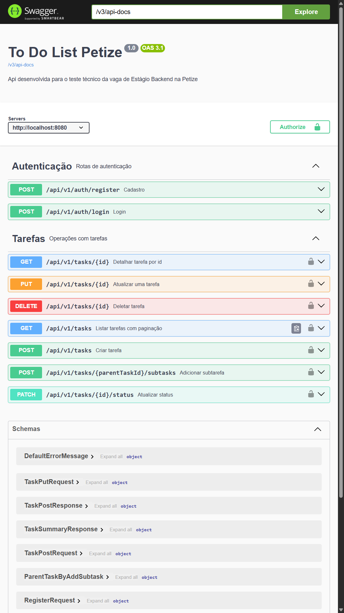

# To Do List API - Petize

> Resolução do Desafio Técnico para a vaga de Estágio Backend, focada em demonstrar conhecimentos em Java, Spring Boot, MySQL e boas práticas de desenvolvimento.

- **Candidato:** Marcus Vinicius Lima Branches - Estudante de Engenharia de Software na Universidade do Estado do Pará (UEPA)
- **Vídeo de Demonstração:** [Explicação das Funcionalidades](https://youtu.be/5moKPlWwqvs)
- 
## 📜 Índice

- [Funcionalidades Implementadas](#-funcionalidades-implementadas)
- [Documentação da API (Swagger)](#-documentação-da-api)
- [Arquitetura e Design](#-arquitetura-e-design)
- [Testes](#-testes)
- [Como Executar o Projeto](#-como-executar-o-projeto)
- [Tecnologias Utilizadas](#-tecnologias-utilizadas)
- [Resumo](#-resumo)

## 🎯 Funcionalidades Implementadas

### Funcionalidades Obrigatórias
- ✅ **CRUD de Tarefas:** Criação, Listagem, Atualização e Deleção.
- ✅ **Filtragem Avançada:** Listagem com filtros combináveis por:
  - Status (`PENDENTE`, `EM_ANDAMENTO`, `CONCLUIDA`)
  - Prioridade (`ALTA`, `REGULAR`, `BAIXA`)
  - Faixa de Data de Vencimento (`dueDateFrom`, `dueDateTo`)
- ✅ **Atualização de Status:** Endpoint `PATCH` específico para alterar apenas o status da tarefa.
- ✅ **Subtarefas:**
  - Criação de subtarefas associadas a uma tarefa "pai".
  - Regra de negócio que **impede a conclusão de uma tarefa** caso ela possua subtarefas pendentes.
  - Deleção em cascata de subtarefas ao remover a tarefa pai.

### Funcionalidades Opcionais (Diferenciais)
- ✅ **Autenticação e Autorização:**
  - Implementação de autenticação via JWT (`Bearer Token`).
  - Rotas protegidas, garantindo que um usuário só possa gerenciar suas próprias tarefas.
- ✅ **Validações Robustas:**
  - Uso do `@Valid` para checagem de campos obrigatórios (`@NotBlank`, `@NotNull`).
  - Mensagens de erro claras e em português para todos os cenários de validação, incluindo datas e enums inválidos.
- ✅ **Paginação e Ordenação:** A listagem de tarefas é paginada para melhor performance e permite ordenação customizada pelo cliente.
- ✅ **Testes Unitários:** Cobertura de testes para a camada de serviço (`TaskService`) utilizando JUnit 5 e Mockito.
- ✅ **Containerização do Banco:** Uso de `Docker Compose` para inicializar o banco de dados MySQL, facilitando a configuração do ambiente de desenvolvimento.

## 📖 Documentação da API
> A API está completamente documentada com Swagger, para visitar a documentação basta acessar a url http://localhost:8080/swagger-ui.html



## 🏛️ Arquitetura e Design

- **Estrutura em Camadas:** O projeto segue uma arquitetura em camadas bem definida (Controller, Service, Repository) para garantir a separação de responsabilidades.
- **Banco de Dados:**
  - O script de inicialização (`/src/main/resources/db/sql/init.sql`) é executado automaticamente pela aplicação.
  - **Estratégia de Indexação:** Para otimizar a performance, foram criados **índices compostos** nas colunas mais utilizadas em filtros (ex: `(user_id, status)`, `(user_id, due_date)`). Essa abordagem é altamente eficiente, pois o banco de dados pode usar um único índice para filtrar por usuário e por outro critério simultaneamente.

## 🧪 Testes
A aplicação possui total cobertura com testes unitários da camada de serviço (a responsável pela lógica de negócio da aplicação), garantindo o correto funcionamento dos componentes isoladamente.

### 🧩 Testes Unitários
- Testa isoladamente cada classe da camada de serviço;
- Uso de mocks com Mockito para simular dependências e garantir teste de lógica pura;
- Garantem que regras de negócio funcionem corretamente sem necessidade de infraestrutura.

### Executando testes
- Para executar os testes, rode o seguinte comando: 
  ```bash
    .\mvnw test
  ```

## 🚀 Como Executar o Projeto

**Pré-requisitos:**
- Java 21
- Docker

**Passos:**
1.  Clone o repositório:
    ```bash
      git clone https://github.com/mbranches/to-do-list-petize.git
      cd to-do-list-petize
    ```
2.  Inicie o banco de dados com Docker Compose:
    ```bash
      docker-compose up -d
    ```
3.  Execute a aplicação Spring Boot via Maven:
    ```bash
      .\mvnw spring-boot:run
    ```
4.  A API estará disponível em `http://localhost:8080`.

## 🛠️ Tecnologias utilizadas

-  - Linguagem de programação utilizada.
-  - Framework para criação da APIs REST em Java.
-  - Framework para mapeamento objeto-relacional.
-  - Implementação da autenticação e autorização com JWT.
-  - Para documentação da API com Swagger UI.
-  - Framework ORM para persistência de dados.
-  - Para conteinerização do Banco de dados MySQL.
-  - Banco de dados utilizado.
-  - Utilizado para testes unitários.
-  - Para gerenciar dependências e automação de builds.

## 🖋 Resumo
No desenvolvimento desta API REST completa, utilizei toda a stack tecnológica da vaga (Java 21, Spring Boot, Security, JPA e MySQL). Fui além do escopo obrigatório e, por iniciativa própria, implementei todos os diferenciais listados, como a criação de testes unitários com JUnit/Mockito para garantir a confiabilidade do código e a containerização do banco de dados com Docker Compose. O foco esteve sempre na qualidade, aplicando uma arquitetura limpa, validações robustas e otimizações de performance com índices, o que demonstra minha capacidade de entregar não apenas um código funcional, mas profissional.

Mais do que as tecnologias, a execução do projeto evidencia minha paixão por resolver problemas complexos, como a implementação de filtros dinâmicos com o padrão Specification. Essa mentalidade de crescimento contínuo e proatividade é o que mais me motiva. Estou pronto e muito animado para levar essa energia para a Petize, aprendendo e contribuindo ativamente com a equipe.